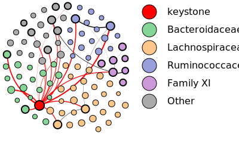
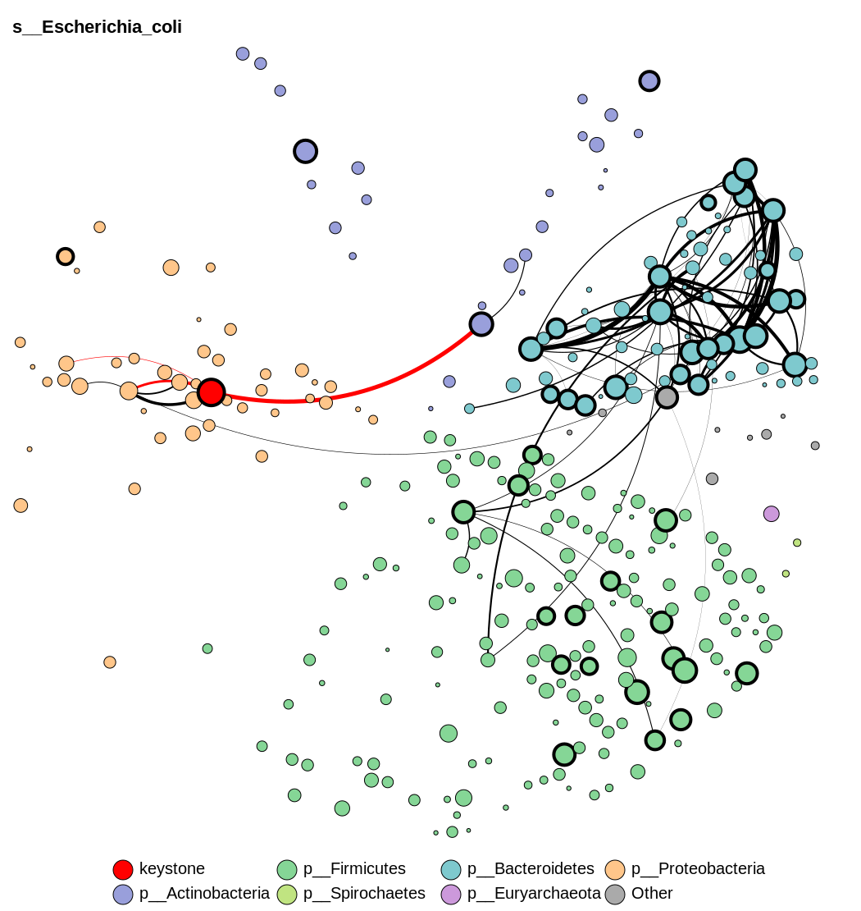
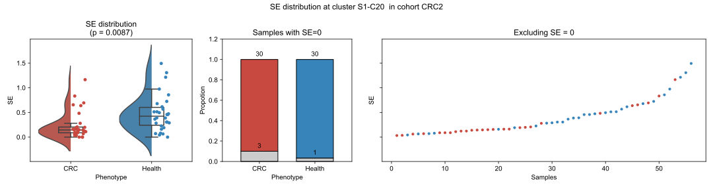
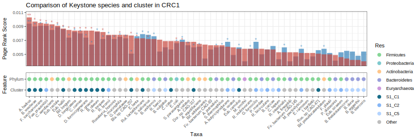
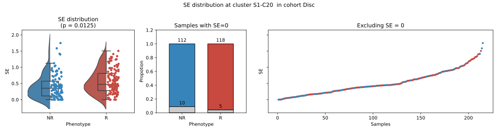

# Tutorial  

## Table of Contents  

- [1. Environment installation](#1-environment-installation)  
- [2. Input files](#3-input-files)  
- [3. Script execution order](#4-script-execution-order)
  - [4.1 Prior GCN structure](#script-prior)
  - [4.2 Completeness](#script-completeness)
  - [4.3 Taxonomy abundance difference](#script-taxa)
  - [4.4 FMT](#script-fmt)
  - [4.5 Antibiotic treatment](#script-anti)
  - [4.6 Personalized FR procedure](#script-personalized)
  - [4.7 NAFLD](#script-nafld)
  - [4.8 NSCLC](#script-nsclc)
  - [4.9 Phenotype SE difference in clusters](#script-pheno)
  - [4.10 Eigenspecies analysis](#script-eigenspecies)
- [5.Plot tools](#plot-tool)

## Environment installation  

### Install with Conda environment  

Create conda enviroment, test under conda 25.1.1
```
conda create -n meta_fr python=3.8 r-base=4.2 -c conda-forge
conda activate meta_fr
```
### Install required python package
```
pip install networkx==2.8.7
pip install ipykernel==5.3.4
pip install ipython==8.12.3
pip install ipython-genutils==0.2.0
pip install matplotlib
pip install pandas==1.1.3
pip install statsmodels==0.14.0
pip install svglib
pip install scikit-learn==1.1.2
pip install scikit-learn-extra==0.2.0
pip install scikit-network==0.27.1
pip install scipy==1.10.1
pip install seaborn==0.12.0
pip install reportlab==3.6.12
pip install lifelines==0.27.8
pip install cliffs-delta
pip install pyseat
pip install numpy==1.22.4
pip install pandas==1.5.2
python -m ipykernel install --user --name meta_fr --display-name "Python (meta_fr)"
```
On your jupyter notebook, choose kernel ```Python (meta_fr)```


💡Note: PySEAT have conflict with numpy version. Please use numpy = 1.22.4 and ignore the warning shows on when you install as
```
pyseat 0.0.1.4 requires numpy>=1.23.3, but you have numpy 1.22.4 which is incompatible.
```  
### Install required R package 

```
conda install r-effsize r-ggplot2 r-ggpubr r-svglite r-reshape2 r-dplyr r-tidyr r-randomForest r-pROC
```


## Input files 
```
git clone https://github.com/deepomicslab/FR_Hierarchy_Gut
cd FR_Hierarchy_Gut/
```
Then please <font color="red">unzip data.zip</font>. You will see **/data** directory.

```
data/
├── gcn2008.tsv                                  # GCN of 2008 species
├── sp_d.tsv                                     # Precomputed distance matrix for 2008 species in GCN
├── module_def0507.tsv                           # Definition of module in KEGG
├── cMD.select_2008.select_genome.list           # Genomes to create GCN2008
├── cMD.select_2008.tax.fullname.txt             # Full taxonomy of species
├── cMD.select_2008.species_phylum.tsv           # Species phylum matching
│
├── [ACVD, CRC, asthma, carcinoma_surgery_history, STH, migraine, BD, IBD, 
│   T2D, hypertension, CFS, IGT, adenoma, schizofrenia]/  # Disease categories
│   ├── [cohort_name1, cohort_name2, ...]/                # Multiple cohorts per disease
│   │   ├── metadata.tsv                                  # Metadata (disease in header)
│   │   └── abd.tsv                                       # Abundance profile (species × samples)
│
├── NAFLD/                                       # NAFLD dataset
│   ├── NASH_forward_63_map.txt                  # Metadata of phenotypes for NASH dataset
│   ├── abd.tsv                                  # 16S species level profile
│   ├── NASH_GCN.tsv                             # GCN of NASH for 16S species name
│   └── taxonomy.tsv                             # Class family species matching
│
├── Anti/                                        # Antibiotic treatment dataset
│   ├── metadata.tsv                             # Metadata
│   ├── abd.tsv                                  # Abundance profile
│   ├── Anti.compare.list                        # Abundance profile
│   ├── Anti.group.tsv                           # Abundance profile
│   └── Antibiotic.diversity.Frederic.tsv        # Abundance profile
│
├── FMT/                                         # Fecal microbiota transplantation dataset
│   ├── FMT1/
│   │   ├── LiSS_2016.tsv                        # Species profile (index: species, header: sample name)
│   │   └── Li.txt                               # Fraction of donor specific strains
│   └── FMT2/
│       ├── Eric_abd.tsv                         # Species level profile
│       └── Eric.txt                             # Fraction of donor specific strains
│
└── immu/                                        # Immunotherapy dataset
    ├── merged_species.tsv                       # Species level abundance profile
    ├── sig.txt                                  # Classification of species in original work
    ├── metadata.txt                             # Metadata including cohort
    ├── DS1_oncology_clinical_data.csv           # Metadata including death, os, akk in original work
    └── DS5_longitudinal_clinical_data.csv       # Metadata including akk level in original work
```
💡NASH_forward_63_map.txt from xxxx CLJ

## Scripts

<font color="red">We highly recommend running the scripts in the directory sequentially in the following order.</font>  


### 1. Prior GCN structure (1.script_priori_tree/)  
Scipts of manuscript section *Constructing a priori functional redundancy hierarchical structure of species via structural entropy*


#### a. Compute species distance from GCN [optional]
```1.script_priori_tree/a.compute_distance.ipynb```

If you want to start the analysis from GCN, please run this script first to compute distance matrix, which will result as ```sp_d.tsv```. This may take some time (around 20 mins). To save time, you can directly use ```sp_d.tsv``` in /data directory which is preproduced.
- input: ```../data/gcn2008.tsv``` GCN of 2008 species
- output: ```../data/sp_d.tsv``` Distance matrix

#### b. Constructing a priori functional redundancy hierarchical structure of species via structural entropy
```1.script_priori_tree/b.GCN_tree.ipynb```

💡please run this script before FMT, NSCLC, Antibiotic, NSCLC which depend on the prior sturcture.

- inputs: 
  - ```data/gcn2008.tsv```
  - ```data/sp_d.tsv```
- outputs:
  - result/GCN_fix_tree/
    - ```renamed_GCN_tree.newick.tsv``` Tree structure in newick format
    - ```leaves_cluster.tsv``` Species FRC annotation

🔍 Preview of ```leaves_cluster.tsv``` 
| species                 | cluster | supercluster |
|-------------------------|---------|--------------|
| s__Rhodococcus_fascians | S2_C1   | S2           |
| s__Nocardia_farcinica   | S2_C1   | S2           |
| s__Rhodococcus_hoagii   | S2_C1   | S2           |


#### c. Detect FRC/supercluster enriched/depleted KOs
```1.script_priori_tree/c.KO_compare.ipynb```
Using S1-C8 as example.
- inputs: 
  - ```data/gcn2008.tsv```
  - ```result/GCN_fix_tree/leaves_cluster.tsv```
- outputs:
  - result/GCN_fix_tree/
    - ```S1_C8.kos_summary.tsv``` Statistic of KOs present in S1-C8
    - ```S1_C8.kos_fisher.tsv``` Fisher testing results

🔍 Preview of ```S1_C8.kos_fisher.tsv``` 
| KO     | S1_C8 Present | S1_C8 Absent | Non S1_C8 Present | Non S1_C8 Absent | Odds Ratio | P-value  | Adjusted P-value |
|--------|---------------|--------------|-------------------|------------------|------------|----------|------------------|
| K03648 | 6             | 48           | 1706              | 248              | 1.82E-02   | 4.47E-35 | 2.63E-31         |
| K00560 | 5             | 49           | 1576              | 378              | 2.45E-02   | 1.30E-28 | 3.80E-25         |
| K02837 | 6             | 48           | 1543              | 411              | 3.33E-02   | 1.54E-25 | 3.01E-22         |

### 2. Completeness of FRC (02.script_signature_modules/)  

Result of manuscript section *Functional redundancy hierarchical structure reveals species clusters with distinct functions*

#### a. Compute the module completeness of each taxon in GCN2008
```02.script_signature_modules/a.genome_module_completeness.ipynb```
- input: 
  - ```data/module_def0507.tsv```
  - ```data/gcn2008.tsv```
- output: 
  - ```result/signature_modules/genome_module.completeness.tsv``` Genome module completenees matrix, with corresponding species name as rownames, with KEGG modules as column.


#### c.Signature modules of superclusters/FRCs  
```02.script_signature_modules/b.signature_modules.ipynb```
(require ```02.script_signature_modules/cluster_completeness_testing.R```)

- input: 
  - ```result/GCN_fix_tree/leaves_cluster.tsv```
  - ```result/signature_modules/genome_module.completeness.tsv```
- output: 
  - result/signature_modules/
    - ```*_species.tsv``` Species involved in comparison with FRC/superclusters annotation
    - ```*.genome_module.completeness.tsv``` Split genome module completeness of each supercluster
    - ```*.module_comp.wilcox.testing.tsv``` Testing results of module completeness comparison
    - ```cluster_module_signature.tsv``` Summary of signature modules of superclusters/FRCs.


### 3. FMT (03.script_FMT)  
Scipts of manuscript section *Structural entropy of vitamin $K_1$, $K_2$ and $B_2$ biosynthesis FRC in the recipient decreased the fecal microbiota transplantation engraftment efficiency*

[**GCN_fix_tree result is required**](#1-prior-gcn-structure-1script_priori_tree)

CLJ
Input: FMT/FMT1, FMT/FMT2  

1. analysis_se*  
Mutiple regression on SE value, days after FMT and fraction at each cluster/supercluster.  

1. analysis_nfr*  
Mutiple regression on nFR, days after FMT and fraction at each cluster/supercluster.

1. analysis_fr*  
Mutiple regression on FR, days after FMT and fraction at each cluster/supercluster.

1. compute_fr*  
Compute FR at each cluster/supercluster for each timepoint.(merge to 3)

1. root_*  
Mutiple regression on FR/nFR/SE, days after FMT and fraction only at root.

- Output
  - abd.tsv
  - [cluster].pdf
  - [cluster].tsv
  - p_values.tsv
  - root.tsv
  - root.pdf


### 4.Antibiotic treatment (04.script_Antibiotic/)  

Scipts of manuscript section *Low preservation of FRCs in the initial state leads to distinct reshaping of the gut microbiome after cefprozil exposure* 

[**GCN_fix_tree result is required**](#1-prior-gcn-structure-1script_priori_tree)

#### a. nFR analysis
```04.script_Antibiotic/a.analysis_nFR.ipynb```

- input: 
  - ```data/sp_d.tsv```
  - ```result/GCN_fix_tree/renamed_GCN_tree.newick```
  - ```data/Anti/metadata.csv```
  - ```data/Anti/abd.csv```
- output: 
  - result/Anti/nFR
    - ```nfr_df.tsv```CLJ
    - ```cluster_[FRC].pdf``` CLJ
    - ```p_value.tsv``` CLJ

#### b. SE analysis
```04.script_Antibiotic/b.analysis_SE.ipynb```

- input: 
  - ```data/sp_d.tsv```
  - ```result/GCN_fix_tree/renamed_GCN_tree.newick```
  - ```data/Anti/metadata.csv```
  - ```data/Anti/abd.csv```
- output: 
  - result/Anti/SE
    - ```se_df.tsv```CLJ
    - ```cluster_[FRC].pdf``` CLJ
    - ```p_value.tsv``` CLJ


#### c. Differential testing of SE/nFR
```04.script_Antibiotic/c.fr_differential_testing.ipynb```

- input: 
  - ```result/Anti/nFR/nfr_df.tsv```
  - ```result/Anti/SE/se_df.tsv```
  - ```data/Anti/Anti.group.tsv``` Group information of samples
- output: 
  - ```result/Anti/nFR/nfr.EB_EN.differential.tsv```
  - ```result/Anti/SE/SE.EB_EN.differential.tsv```

Results as Supplementary Table S5

🔍 Preview of ```SE.EB_EN.differential.tsv``` 
| FR | Group1 | Group2 | Cluster       | p_value | enriched | mean_g1 | mean_g2 |
|----|--------|--------|---------------|---------|----------|---------|---------|
| SE | EB_7   | EN_7   | cluster_S1-C1 | 0.0135  | EB_7     | 0.3299  | 0.0997  |
| SE | EB_7   | EN_7   | cluster_S1-C8 | 0.0415  | EN_7     | 0.0140  | 0.1108  |
| SE | EB_7   | EN_7   | cluster_S3-C1 | 0.0296  | EB_7     | 0.0043  | 0.0004  |


#### d. Eigenspecies analysis 
```04.script_Antibiotic/d.eigenspecies.ipynb```
(require ```04.script_Antibiotic/eigenspecies_utils.py```)
- prepare group file for comparison pairs, two groups in one comparison
- calculate eigenspecies of all FRCs in all samples in two groups
- construct eigenspecies correlation network for two groups respectively
- preservation matrix of correlation matrices between two groups
- compare eigenspecies networks difference between two groups

- input: 
  - ```data/Anti/Anti.group.tsv``` Group information of samples
  - ```data/Anti/Anti.compare.list``` Comparision list of groups, e.g EB0 EN0
  - ```result/GCN_fix_tree/leaves_cluster.tsv```
  - ```data/Anti/abd.tsv```
- output for given group ```{g1}``` and group ```{g2}```: 
  - result/Anti/eigenspecies
    - ```{g1}.{g2}.group.tsv``` Samples of two groups
    - ```{g1}.{g2}.eigenspecies.csv``` Eigenspecies of FRC
    - ```{g1}.{g2}.eigenspecies_cor.{g1}.tsv``` Eigenspecies correlation network of ```{g1}```
    - ```{g1}.{g2}.eigenspecies_cor.{g2}.tsv``` Eigenspecies correlation network of ```{g2}```
    - ```{g1}.{g2}.preserv_matrix.tsv``` Preservation matrix of two eigenspecies correlation networks
    - ```{g1}.{g2}.preserv_matrix.png``` Visualization of preservation matrix
    - ```{g1}.{g2}.compare_eigenspecies_networks.tsv``` Differential testing of FRC eigenspecies between two groups


#### e. Correlation between eigenspecies and taxonomic diversity
```04.script_Antibiotic/e.correlation_diversity.ipynb```
- input: 
  - ```data/Anti/Antibiotic.diversity.Frederic.tsv``` Taxonomic diversity provided in 10.1038/ismej.2015.148 Supptable1
  - ```result/Anti/eigenspecies/EB_0.EN_0.eigenspecies.csv``` Eigenspecies of EB and EN at day0.
- output:
  - Correlation of FRC and diversity with p-value in notebook.

### 5.Taxonomy abundance difference (script_abundance_check)  


Input: ACVD/, CRC/, asthma/, carcinoma_surgery_history/, STH/, migraine/, BD/, IBD/, T2D/, hypertension/, CFS/, IGT/, adenoma/, schizofrenia/, NAFLD/  
large-scale + NAFLD

1. taxa/taxa_NAFLD
Check the abundance difference for each taxon (including NAFLD 16s OTU).  

Output: result/taxa_abd_check/, result/taxa_abd_check_NAFLD/


### Personalized FR procedure (script_procedure)  

<a id="script-personalized"> </a> Result - Integrating taxonomic composition to construct a personalized FR network  

Input: ACVD/, CRC/, asthma/, carcinoma_surgery_history/, STH/, migraine/, BD/, IBD/, T2D/, hypertension/, CFS/, IGT/, adenoma/, schizofrenia/

1. step1_compute_distance  
Compute functional distance for GCN2008.
  
2. <span id="pheno_anlaysis">step2_cluster_analysis</span>  
Analyze keystone cluster and keystone taxon for metagenomics abundance profiles in cMD by constructing posterior structure.  

3. step3_keystone_summary  
Summarize the keystone species.  

4. utils  

    **a. log_effect**  
    Compute and compare the distribution of personalized FR network before and after log rescalen and normalization.

    **b. nestedness_experiment**  
    An example to test the nestedness compared with NULL experiments of personalized FR.

    **c. evaluation**  
    An example to evaluate the feature of GCN.  

Output: result/GCN_evaluation/, result/pheno_result/  

### NAFLD (script_NAFLD)  

Result - FR keystone species in personalized FR network reveals polycentric structure in healthy individuals and monocentric in non-alcoholic steatohepatitis patients  
#### b. Compute the module completeness of each taxon in NAFLD 16s OTU
```script_completeness/completeness_NAFLD.ipynb```

- input: 
  - ```data/module_def0507.tsv```
  - ```data/NAFLD/NASH_GCN.tsv```
- output: 
  - ```result/completeness_NAFLD/genome_module.completeness.tsv```


Input: NAFLD/  

1. step0_NAFLD  
An example of constructing personalized FR netowrk, hierarchical tree, keystone species/cluster and comparing keyston clusters of taxa on NAFLD dataset.  

Output: result/NAFLD  

### NSCLC (script_NSCLC)  

[**GCN_fix_tree result is required**](#1-prior-gcn-structure-1script_priori_tree)

<a id="script-nsclc"> </a>Result - FRCs as immune checkpoint inhibitor indicators can predict patient survival  

Input: immu/

1. SE  
Test difference of SE between response group and non-response group at each cluster/supercluster and compute FR S score for each sample.

2. sig_SE  
Test difference of SE between response group and non-response group at SIG1/SIG2 clsuter raised in original study and compute S score for each sample.

3. combination  
Compute combined sig' S score for each sample.

4. The r scripts
Used to produce the analysis in original study and is provided by https://github.com/valerioiebba/TOPOSCORE/tree/main.  

Output: result/immu  

### Phenotype SE difference in clusters (script_GCN_d3)  

[**GCN_fix_tree result is required**](#1-prior-gcn-structure-1script_priori_tree)

<a id="script-pheno"> </a>Result - Structural entropy of FRCs identified as robust phenotype-specific indicators  

Input: ACVD/, CRC/, asthma/, carcinoma_surgery_history/, STH/, migraine/, BD/, IBD/, T2D/, hypertension/, CFS/, IGT/, adenoma/, schizofrenia/

1. SE_diff / NFR_diff  
Check SE/nFR difference of disease and health group.  

2. check_SE_diff / check_NFR_diff  
Output some detail statistic information of SE/nFR.  

3. CRC_recurrent_ROC.ipynb  
Predict CRC by LODO.

4. IBD_recurrent_ROC.ipynb  
Predict IBD by LODO.

5. IBD_ROC.ipynb  
Predict IBD by cross-validation.  

Output: result/GCN_fix_tree/, result/predict/, result/predict_IBD/

### Eigenspecies analysis (script_eigen_graph_preservation)  

<a id="script-eigenspecies"> </a>Result - Eigenspecies of FRCs demonstrate potential as cross-cohort indicators of age and BMI  

[**GCN_fix_tree result is required**](#1-prior-gcn-structure-1script_priori_tree)

Input: ACVD/, CRC/, asthma/, carcinoma_surgery_history/, STH/, migraine/, BD/, IBD/, T2D/, hypertension/, CFS/, IGT/, adenoma/, schizofrenia/

1. run.ipynb  
Find eigen species and plot the result.  

Output: result/eigen/

## Plot tool  


Scripts under **plot_tools/** are used to plot figures.  

1. init_network  
Input: cMD.select_2008.species_phylum.tsv
init FR network layout  
Output: sector layout file sector_sp_layout.tsv for network plot

2. NAFLD_draw  
Input: NAFLD/taxonomy.tsv, result/NAFLD created by script_NAFLD/
Plot networks of NASH and health dataset.  
Output:   

3. procedure_draw_network  
Input: sector_sp_layout.tsv created by step1.init_network, result/pheno_result/ created by script_procedure/
Scripts used to plot personalized FR network for disease and health group.  
Output:   

4. pheno_distribution_se  
Input: result/GCN_fix_tree/SE/GCN_tree_diff/ created by script_GCN_d3  
Plot SE distribution for disease and health group.  
Output:   

5. plot_keystone.ipynb  
Input: result/pheno_result/ created by script_procedure/, result/taxa_abd_check/ created by script_abundance_check, result/GCN_fix_tree/leaves_cluster.tsv created by script_priori_tree/
Plot keystone result of phenotype datasets.  
Output:   

6. NSCLC_distribution_se  
Input: result/immu/SE/ created by script_NSCLC/  
Plot SE distribution for response group and non-response group.  
Output:   
